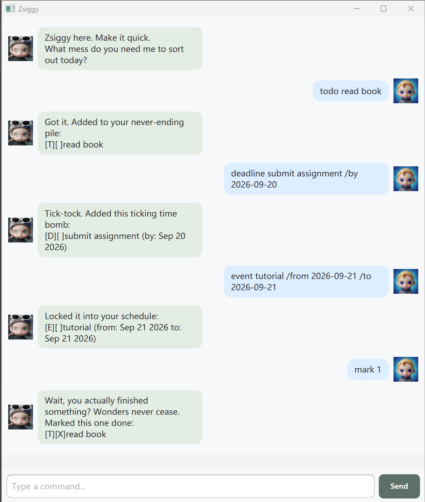

# Zsiggy User Guide



Zsiggy keeps track of your todos, deadlines, and events. It may grumble, but it gets the organising done.

## Quick start

1. Install **Java 25**. Check your installation with `java -version` in a terminal.
2. Download `zsiggy.jar` from the [latest release](https://github.com/luziyue525/ip/releases/latest).
3. Place it in its own folder, open a terminal in that folder, and run:

   ```text
   java -jar zsiggy.jar
   ```

4. Type a command in the input box and press **Enter** or click **Send**.

The release bundles JavaFX for Windows x64, Linux x64, and macOS Intel/Apple Silicon.
Use a Java installation matching your computer's architecture. Linux needs a graphical desktop and GTK 3.

## Commands

Commands and search text are **case-sensitive**. Extra spaces and tabs are treated as a single space, and leading/trailing spaces are ignored. Empty input is ignored in the GUI.

| Action | Command | Example |
| --- | --- | --- |
| List all tasks | `list` | `list` |
| Add a todo | `todo DESCRIPTION` or `t DESCRIPTION` | `t read book` |
| Add a deadline | `deadline DESCRIPTION /by YYYY-MM-DD` | `deadline submit assignment /by 2026-09-20` |
| Add an event | `event DESCRIPTION /from YYYY-MM-DD /to YYYY-MM-DD` | `event tutorial /from 2026-09-20 /to 2026-09-21` |
| Mark as done | `mark INDEX` | `mark 1` |
| Mark as not done | `unmark INDEX` | `unmark 1` |
| Delete a task | `delete INDEX` | `delete 1` |
| Search descriptions | `find KEYWORD` | `find book` |
| Close the app | `bye` | `bye` |

### Adding tasks

Descriptions are required. Todos have no date; deadlines have one due date; events have start and end dates. Dates must be real calendar dates in `YYYY-MM-DD` format. For example, `2028-02-29` is valid; `2026-02-30` is rejected.

For events, put `/from` before `/to`, with each marker appearing once. The end date cannot precede the start date; same-day events are allowed. The strings `/from` and `/to` are reserved in event descriptions. Use `/by` once when adding a deadline.

Descriptions must stay on one line and cannot contain `|`, which is reserved for the save-file format. An identical task of the same type, description, and dates is rejected even if the existing task is marked done. Comparison is case-sensitive after spaces are normalised. Different task types or different dates are allowed.

Example:

```text
todo read book
```

Response:

```text
Got it. Added to your never-ending pile:
[T][ ] read book
```

### Listing, updating, and deleting

`list` shows tasks in insertion order. `[T]`, `[D]`, and `[E]` indicate todo, deadline, and event. `[ ]` means not done; `[X]` means done.

```text
1. [T][ ] read book
2. [D][X] submit assignment (by: Sep 20 2026)
3. [E][ ] tutorial (from: Sep 20 2026 to: Sep 21 2026)
```

Use the task number as `INDEX`. `mark 1` marks the book task as done; `unmark 1` reverses that. `delete 1` removes it permanently. Remaining tasks are renumbered after deletion, so check `list` before your next update. There is no undo command.

### Searching

`find KEYWORD` searches for a case-sensitive substring in task descriptions. The search can contain multiple words. `find book` matches `read book` but not `read Book`.

Search results retain their **full-list numbers**, so a result numbered `3` can be updated with `mark 3`. An empty result shows the matching-tasks heading with no task rows.

### Invalid input

Errors appear in a red message bubble and do not change saved tasks. Zsiggy explains missing descriptions, invalid dates, duplicate tasks, invalid task numbers, and unknown commands. Use a positive whole number referring to an existing task for `mark`, `unmark`, and `delete`. `list` and `bye` take no extra arguments.

## Saving and recovery

Tasks are saved automatically after each successful add, mark, unmark, or delete. The file is **`data/tasks.txt` relative to the folder from which you launch Zsiggy**. Start from the same folder each time to load the same list. If the file does not exist, Zsiggy starts empty and creates it when you first save a task.

A failed save produces an error and reverses that command's changes in memory. Keep the launch folder writable. Zsiggy writes to a temporary file before replacing the save file to reduce the risk of losing data.

If an existing file cannot be read or contains an invalid record, Zsiggy opens with a warning and disables saving to protect the original file. Close the app, back up `data/tasks.txt`, then repair the indicated line or restore a known-good backup and restart. If you prefer to start over, move the backed-up file out of `data` before restarting. Do not delete the only copy of tasks you need.

## Closing Zsiggy

Enter `bye` or use the window's close button. Each successful task change has already been saved.
